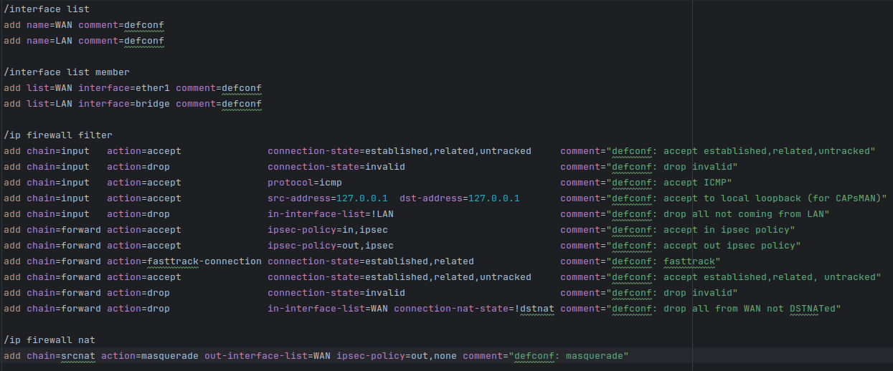

# RouterOS Script Support

An IntelliJ IDEA plugin that adds support for MikroTik RouterOS scripts (`.rsc`, `.ros`).



## Features

- Syntax highlighting: commands, paths, properties, variables, strings, comments
- Recognition of RouterOS keywords and paths
- Bracket matching (`{}`, `[]`, `()`)
- Comment support (`#`)
- Customizable color scheme (Settings → Editor → Color Scheme → RouterOS)

## Requirements

- IntelliJ IDEA 2024.1+ (build 241+), Community or Ultimate
- JDK 17

## Build

```bash
./gradlew buildPlugin
```

The resulting ZIP will be in `build/distributions/`.

## Run in a sandbox IDE

```bash
./gradlew runIde
```

## Installation

1. Build the plugin: `./gradlew buildPlugin`
2. In the IDE: **Settings → Plugins → ⚙ → Install Plugin from Disk…**
3. Select the ZIP from `build/distributions/`

## Structure

```
src/main/
├── kotlin/com/mikrotik/routeros/   — language implementation (lexer, highlighter, etc.)
└── resources/
    ├── META-INF/plugin.xml          — plugin descriptor
    ├── icons/                       — icons
    └── com/mikrotik/routeros/       — command, path, and property dictionaries
```

## License

[MIT](LICENSE)